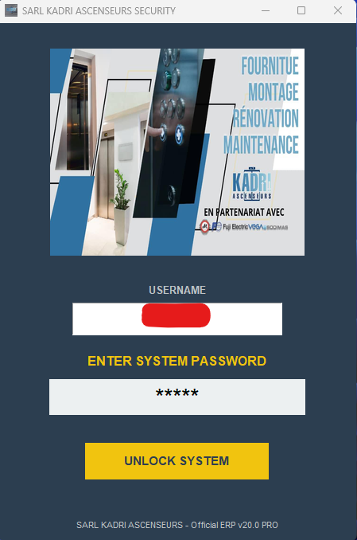
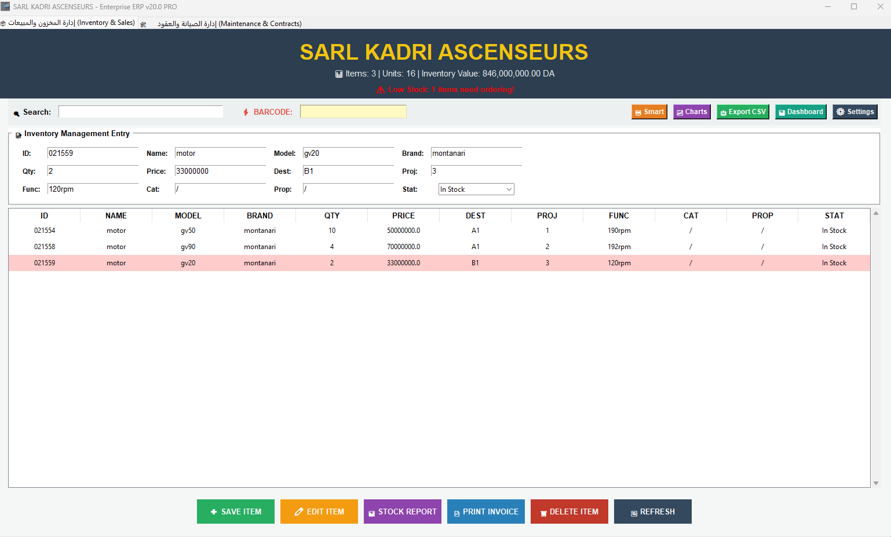

# 🏢 Industrial ERP — Maintenance & Inventory Management System

> Desktop ERP application built for SARL Kadri Ascenseurs (elevator installation & maintenance company).  
> Python · Tkinter · SQLite · ReportLab PDF · License System · v20.0 PRO

**Author:** Bencheikh Mohamed Idris  
**Background:** M.Sc. Automation & Industrial Computing — Université Blida 1 (Valedictorian)  
**Contact:** bencheikhmohamed800@gmail.com

---

## 📸 Screenshots

### Login Screen


### Inventory Management Dashboard


---

## ✅ Features

### 📦 Inventory & Sales Module
- Full inventory management (add, edit, delete, search)
- Barcode scanner integration
- Real-time stock value calculation
- Low stock alerts (automatic detection)
- PDF invoice generation with company header & logo
- Full stock report (PDF, landscape)
- CSV export
- Interactive charts (matplotlib)
- Smart restock recommendations (AI-assisted)

### 🛠️ Maintenance & Contracts Module
- Elevator maintenance contract management
- Contract status tracking (Active / Expired / Suspended)
- Technician database management
- Maintenance task scheduling & history
- Elevator type classification (Montanari, VEGA, Orona, Fermator...)

### 🔐 Security System
- Hardware-based license system (SHA-256 + Device UUID)
- Encrypted user authentication (SHA-256 password hashing)
- Role-based access control (ADMIN / USER)
- Automatic database backup on startup
- Full action audit log (who did what, when)

### ⚙️ System Settings
- Dynamic company profile (name, address, phone, email, currency)
- JSON-based configuration — no code changes needed
- In-app credentials management with current password verification

---

## 🏗️ Architecture

```
main.py
│
├── License System (SHA-256 + Device UUID)
├── Config System (config.json → dynamic company data)
│
├── Database Layer (SQLite)
│   ├── inventory     — parts, motors, equipment
│   ├── users         — authentication & roles
│   ├── logs          — audit trail
│   ├── invoices      — sales records
│   ├── technicians   — field engineers
│   ├── contracts     — maintenance agreements
│   └── maintenance_tasks — scheduled interventions
│
├── Business Logic
│   ├── save_data()        — CRUD operations
│   ├── smart_restock()    — AI stock recommendations
│   ├── create_invoice_pdf() — PDF generation
│   └── create_stock_report() — Full inventory PDF
│
└── UI Layer (Tkinter + ttk)
    ├── Login window
    ├── Inventory tab (Treeview + search + barcode)
    └── Maintenance tab (contracts + tasks)
```

---

## 🛠️ Technologies

| Component | Technology |
|-----------|-----------|
| Language | Python 3.10 |
| GUI Framework | Tkinter + ttk |
| Database | SQLite3 |
| PDF Generation | ReportLab |
| Charts | Matplotlib |
| Security | hashlib (SHA-256), uuid |
| Config | JSON |
| Packaging | PyInstaller (.exe) |

---

## 🚀 Installation

```bash
git clone https://github.com/Idriss099/industrial-erp-maintenance-system.git
cd industrial-erp-maintenance-system

pip install pillow reportlab matplotlib

python main.py
```

Default credentials:
- Username: `admin`
- Password: `admin`

---

## 🏭 Real-World Deployment

This system was developed and deployed for **SARL Kadri Ascenseurs** (Blida, Algeria), a company specializing in elevator installation, maintenance, and modernization.

**Real data managed by the system:**
- Elevator components inventory (motors, encoders, photocells, control boards)
- Maintenance contracts for residential and commercial buildings
- Technical interventions and field technician scheduling
- Sales invoices and stock reports

---

## 🔬 Research Relevance

This project demonstrates practical implementation of:
- **Lightweight ERP systems** for SMEs in industrial sectors
- **Maintenance Management Information Systems (MMIS)**
- **Digital transformation** of manual maintenance workflows
- **Industry 4.0** digitalization at the SME level

Combined with the [Digital Twin Predictive Maintenance](https://github.com/Idriss099/digital-twin-predictive-maintenance) project, these two systems represent a complete **Industrial Maintenance 4.0 ecosystem**: from field sensor data to business management.

---

## 📬 Contact

I am actively seeking **PhD opportunities** in:
- Digital Twin for industrial systems
- Predictive Maintenance & PHM
- Industry 4.0 / Cyber-Physical Systems
- Industrial IoT

**Email:** bencheikhmohamed800@gmail.com  
**LinkedIn:** linkedin.com/in/fresh-highachievingautomationengineer-bencheikh-mohamedidris  
**Digital Twin Project:** https://github.com/Idriss099/digital-twin-predictive-maintenance
